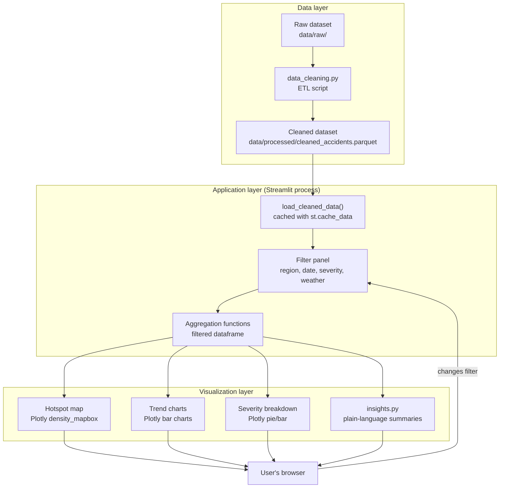
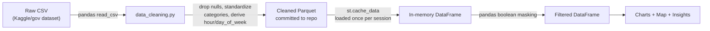
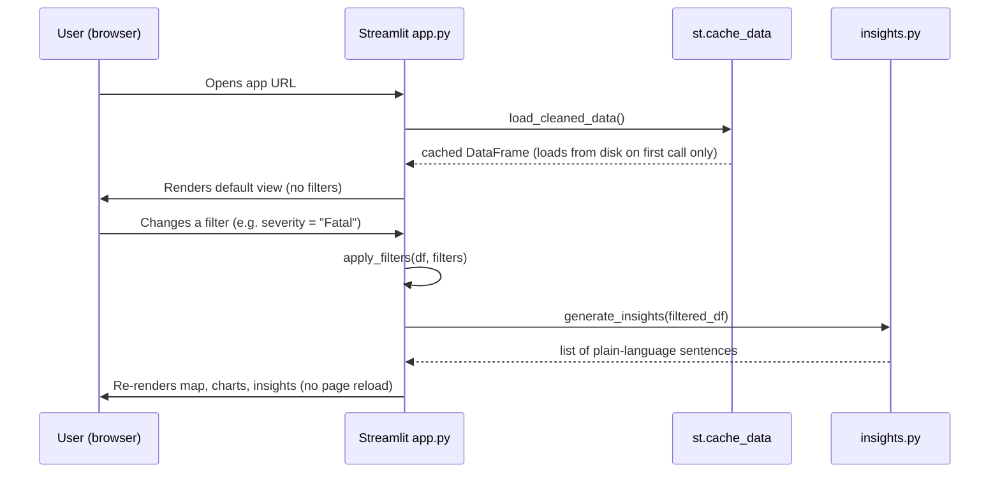
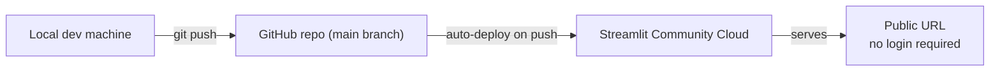

# Architecture — Road Accident Insight Explorer

**Status:** Approved Day 2 design — source of truth for implementation (Days 3–9)
**Related docs:** `PRD_Road_Accident_Insight_Explorer.md`, `Implementation_Blueprint_Days_2-10.md`, `SCHEMA.md`, `API.md`, `UI-WIREFRAMES.md`, `PROJECT-STRUCTURE.md`

---

## 1. Architecture style

This is a **monolithic, single-process web application** built with Streamlit. There is no separate frontend/backend split, no REST API layer, and no database server. Streamlit's Python process handles UI rendering, filtering logic, and chart generation in one runtime, reloading top-to-bottom on every user interaction (with caching to avoid redundant work).

This is intentional, not a simplification we're settling for: the PRD requires no accounts, no real-time data, and free-tier deployment (NFR-4). A multi-service architecture would add operational complexity with no corresponding user value.

---

## 2. Finalized tech stack

| Layer | Choice | Rationale |
|---|---|---|
| UI + app logic | **Streamlit** | Converts pandas/SQL skills directly into a reactive app; free hosting via Streamlit Community Cloud |
| Data processing | **pandas**, **numpy** | Matches existing skillset; sufficient for a dataset in the thousands-of-rows range |
| Visualization | **Plotly** (`plotly.express`) | One library for both charts and the hotspot map (`density_mapbox`), reducing deployment risk vs. adding a second mapping library |
| Data storage | **Parquet file** (`data/processed/cleaned_accidents.parquet`), CSV fallback | No database server needed for a static, read-only analytical dataset |
| Authentication | None | Out of scope per PRD |
| AI/LLM API | None — insights are rule-based | Deterministic, free, fast; no API keys or external dependency |
| Hosting | **Streamlit Community Cloud** | Free, connects directly to GitHub |
| Source control | **GitHub** | Already set up |

---

## 3. Component diagram

**Key point:** the ETL step (`data_cleaning.py`) runs **once, offline**, during Days 3–4 — not on every app load. The deployed app only ever reads the already-cleaned Parquet file. This keeps runtime fast and avoids re-cleaning data on every user session.

---

## 4. Data flow

---

## 5. Request lifecycle (single user interaction)

Streamlit re-runs the whole script top-to-bottom on every widget interaction; `st.cache_data` on the data-loading function is what prevents re-reading the Parquet file from disk each time — only the filtering and chart-building logic re-executes.

---

## 6. External services

| Service | Purpose | Free tier? |
|---|---|---|
| GitHub | Source control, triggers deployment | Yes |
| Streamlit Community Cloud | Hosting | Yes |

No third-party APIs are called at runtime. This keeps the app resilient (no external outage risk) and free (no API cost risk).

---

## 7. Error handling & edge cases (NFR-3)

| Scenario | Handling |
|---|---|
| Filter combination returns 0 rows | Show a graceful "No accidents match these filters — try widening your selection" message instead of blank/broken charts |
| Missing coordinates for some rows | Excluded from the map only, but still counted in trend charts and insights, with a small note if the excluded count is significant |
| Dataset fails to load at startup | Show a clear error message rather than a stack trace; this should not happen in production since the Parquet file ships with the repo |

---

## 8. Deployment architecture

Deployment is covered in full on Day 9 of the Blueprint; this section just confirms the target shape so nothing here conflicts with that plan.
