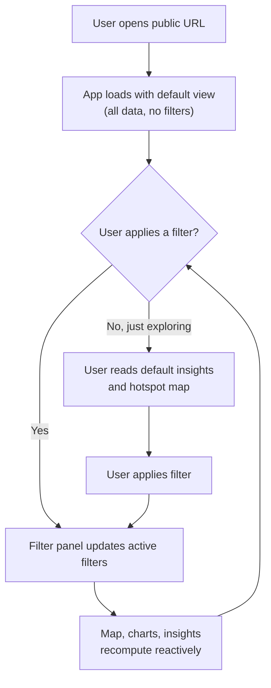

# UI & User Flow — Road Accident Insight Explorer

**Status:** Approved Day 2 design

## 1. Screen inventory

This is a **single-screen application** — there is no navigation between pages. This is a deliberate choice, not an oversight: the PRD's primary persona is a non-technical user (NFR-1), and every additional screen is an additional place they can get lost. All filtering happens in place, with instant reactive updates (FR-7), which is exactly what makes a single-screen layout viable here.

| Screen | Exists because... |
|---|---|
| Main explorer (only screen) | Every one of the 5 user stories in the PRD is satisfied by filtering + viewing visualizations in one place — there is no second workflow that needs its own screen |

---

## 2. User flow diagram



---

## 3. Screen layout wireframe (low-fidelity, text-based)

```
┌──────────────────────────────────────────────────────────────────────┐
│  Road Accident Insight Explorer                                       │
├───────────────┬──────────────────────────────────────────────────────┤
│  FILTER PANEL │  INSIGHTS PANEL (auto-generated, plain language)      │
│  (left/top)   │  • 62% of accidents occurred between 5–8 PM           │
│               │  • Rainy conditions accounted for 21% of severe cases │
│  Region     ▾ │  • [Region X] has the highest concentration overall   │
│  Date range ▾ │                                                       │
│  Severity   ▾ ├──────────────────────────────────────────────────────┤
│  Weather    ▾ │  HOTSPOT MAP (center, largest area)                   │
│  Road type  ▾ │  [ interactive Plotly density map ]                  │
│               │                                                       │
│  [Reset all]  │                                                       │
├───────────────┴──────────────────────────────────────────────────────┤
│  TREND CHARTS (bottom row)          │  SEVERITY BREAKDOWN             │
│  [ hour-of-day bar chart ]          │  [ severity distribution chart] │
│  [ day-of-week bar chart ]          │                                 │
└──────────────────────────────────────────────────────────────────────┘
```

On mobile widths, this stacks vertically in the order: Filter panel (collapsible) → Insights → Map → Trend charts → Severity breakdown.

---

## 4. Why each screen zone exists (traceability to PRD)

| Zone | PRD requirement it satisfies |
|---|---|
| Filter panel | FR-2 (filter by region, time, severity, weather); NFR-1 (usable without instructions) |
| Insights panel | FR-6 (auto-generated plain-language insights) — placed near the top since it's the "so what" for a non-technical user, not buried below raw charts |
| Hotspot map | FR-3 (accident density/hotspots) |
| Trend charts | FR-4 (time-of-day, day-of-week trends) |
| Severity breakdown | FR-5 (severity distribution) |
| "Reset all" control | NFR-1 usability — lets a confused first-time user recover without reloading the page |

Every zone maps to a numbered functional requirement — nothing was added "because it looks nice." This is deliberate, per the PRD's scope-discipline rule.

---

## 5. Navigation

None required. There is no menu, no routing, no back button dependency. The only interactive elements are the filter widgets themselves, which is consistent with NFR-1 (a first-time non-technical user must be able to use core filters without instructions).

---

## 6. Empty/edge states (NFR-3)

| State | UI treatment |
|---|---|
| Filters return 0 rows | Map, charts, and insights panel all show a consistent message: *"No accidents match these filters. Try widening your selection."* — never a blank chart or error |
| App just loaded (no filters yet) | Shows the full unfiltered dataset by default, so the user immediately sees something meaningful rather than an empty screen |
